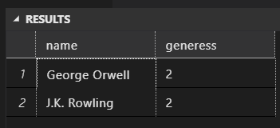
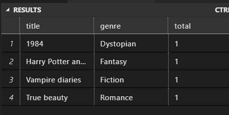
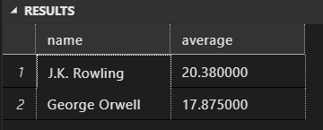
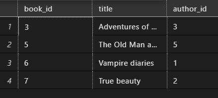
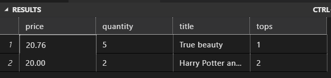
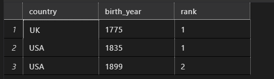
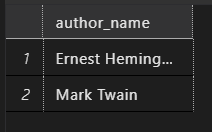
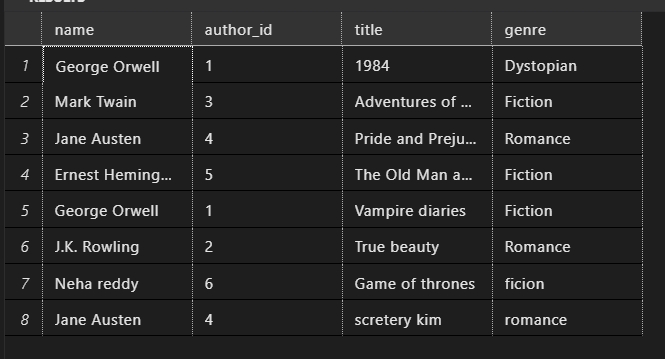
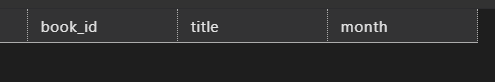
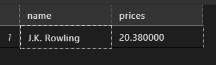

**Task 1**

> Write a query to display authors who have written books in multiple genres and group the results by author name.

```sql
select a.name, count(distinct b.genre) as generess
from authors a
    join books b
    on b.author_id = a.author_id
group by a.name
having count(distinct b.genre)>1
```



**Task 2**

> Write a query to find the books that have the highest sale total for each genre and group the results by genre.

```sql
with
    cte
    as

    (
        select title, genre, rank() over (partition by genre order by total_amount  desc)  as total
        from sales s
            join books b
            on s.book_id= b.book_id
    )
select *
from cte
where total = 1
order by total desc
```



**Task 3**

> Write a query to find the average price of books for each author and group the results by author name, only including authors whose average book price is higher than the overall average book price.

```sql
select name, avg(price) as average
from books b
    join authors a
    on a.author_id = b.author_id
group by name
having avg(price) > (select avg(price )
from books)
order by average desc
```



**Task 4**

> Write a query to find authors who have sold more books than the average number of books sold per author and group the results by country.

```sql
with
    cte
    as
    (
        select b.book_id, b.title, a.author_id, s.sale_id , sum(s.quantity) as sum
        from books b
            join authors a
            on a.author_id = b.author_id
            join sales s
            on s.book_id = b.book_id
        group by b.book_id, b.title, a.author_id,  a. name, s.sale_id
    )
select *
from cte
where sum > (select avg(s.quantity) as average
from sales s)
```



**Task 5**

> Write a query to find the top 2 highest-priced books and the total quantity sold for each, grouped by book title.

```sql

with
    cte1
    as
    (
        select
            b.price , s.quantity , b.title, rank() over (order by b.price desc )  as tops
        from books b
            join sales s
            on s.book_id = b.book_id
    )
select *
from cte1
where tops <=2
```



**Task 6**

> Write a query to display authors whose birth year is earlier than the average birth year of authors from their country and rank them within their country.

```python
with
    cte7
    as
    (
        select country,
            birth_year,
            rank() over (partition by country order by birth_year ) as rank
        from authors a
        where birth_year <
                  (select avg(birth_year) as avgOfAuthors
        from authors a1
        where a.country = a1.country
        group  by country
                  )
    )
select *
from cte7
where rank <=2
```



**Task 7**

> Write a query to find the authors who have written books in both 'Fiction' and 'Romance' genres and group the results by author name.

```sql
    SELECT a.name AS author_name
    FROM authors a
        JOIN books b ON a.author_id = b.author_id
    WHERE b.genre = 'Fiction'
INTERSECT
    SELECT a.name AS author_name
    FROM authors a
        JOIN books b ON a.author_id = b.author_id
    WHERE b.genre = 'Romance'
ORDER BY author_name;
```



**Task 8**

> Write a query to find authors who have never written a book in the 'Fantasy' genre and group the results by country.

```sql
select a.name, a.author_id, b.title , b.genre
from authors a
    join books b
    on b.author_id = a.author_id
where b.genre not like 'fantasy'
-- group by country
```



**Task 9**

> Write a query to find the books that have been sold in both January and February 2024 and group the results by book title.

```sql
  select b. book_id, title , datepart(month, s.sale_date) as month
  from books b
      join sales s
      on s.book_id = b.book_id
  group by b. book_id, title ,datepart(month, s.sale_date)
  having datepart(month, s.sale_date) =1

intersect
select b. book_id, title , datepart(month, s.sale_date) as month
from books b
join sales s
on s.book_id = b.book_id
group by b. book_id, title ,datepart(month, s.sale_date)
having datepart(month, s.sale_date) =2

```



**Task 10**

> Write a query to display the authors whose average book price is higher than every book price in the 'Fiction' genre and group the results by author name.

```sql
with
    cte
    as
    (
        select a.name , avg(price) as prices
        from books b
            join authors a
            on a.author_id = b.author_id
        group by a.name
    )
select *
from cte
where prices >
All(
select price
from books
where genre = 'fiction')
```


