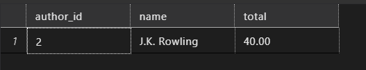
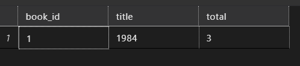
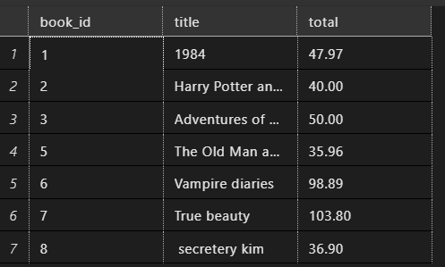
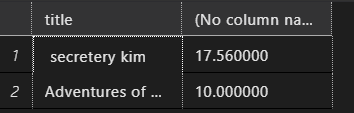
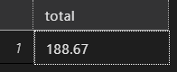
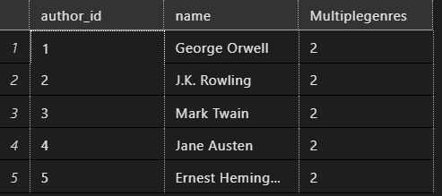
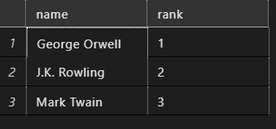
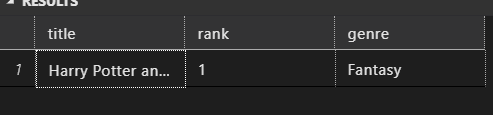
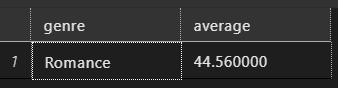

## Section 2

**Task 1**:

> Stored Procedure for Total Sales by Author

> Create a stored procedure to get the total sales amount for a specific author and write a query to call the procedure for 'J.K. Rowling'.

```sql
go
create proc TotalSalesByAuthor
    @name varchar(50)
AS
begin
    select a.author_id, a.name, sum(total_amount) as total
    from sales s
        join books b
        ON b.author_id = s.book_id
        join authors a
        on a.author_id = b.book_id
    where a.name = @name
    GROUP BY a.author_id, a.name
end
go
exec TotalSalesByAuthor @name = 'J.K. Rowling'
```



**Task 2:**

> Function to Calculate Total Quantity Sold for a Book

> Create a function to calculate the total quantity sold for a given book title and write a query to use this function for '1984'.

```sql
go
create function dbo.TotalQuantitySold(
    @title varchar(50)
)
returns table
AS
RETURN(
  select b.book_id, b.title, sum(s.quantity) as total
from sales s
    join books b
    ON b.book_id = s.book_id
where b.title = @title
GROUP BY b.book_id, b.title
    );

go

select *
from dbo.TotalQuantitySold ('1984')
```



**Task 3:**

> View for Best-Selling Books

> Create a view to show the best-selling books (those with total sales amount above $30) and write a query to select from this view.

```sql
go
create view viewBestSellingBooks
as
    select b.book_id, b.title, sum(s.total_amount) as total
    from sales s
        join books b
        ON b.book_id = s.book_id
    GROUP BY b.book_id, b.title
    having sum(s.total_amount) > 30
go

select *
from viewBestSellingBooks
Go
```



**Task 4:**

> Stored Procedure for Average Book Price by Author

> Create a stored procedure to get the average price of books for a specific author and write a query to call the procedure for 'Mark Twain'.

```sql
create proc AverageBookPricebyAuthor
    @authname varchar(50)
AS
BEGIN
    select b.title, avg(price)
    from books b
        join authors a
        on a.author_id = b.author_id
    where name= @authname
    group by name, b.title
END
exec AverageBookPricebyAuthor @authname= 'Mark Twain'
```



**Task 5:**

> Function to Calculate Total Sales in a Month

> Create a function to calculate the total sales amount in a given month and year, and write a query to use this function for January 2024.

```sql
go
create function CalculateTotalSalesinaMonth(
    @month varchar(50), @year int
)
RETURNS TABLE
AS
return
(
    select sum(total_amount) as total
from sales
where DATENAME(month, sale_date) = @month and year(sale_date) = @year
)
GO
select *
from CalculateTotalSalesinaMonth('January', 2024)
GO
```



**Task 6:**

> View for Authors with Multiple Genres

> Create a view to show authors who have written books in multiple genres and write a query to select from this view.

```sql
go
create view AuthorswithMultipleGenres
AS
    select a.author_id, a.name , count(distinct genre) as Multiplegenres
    from authors a
        join books b
        on b.author_id = a.author_id
    group by a.author_id, a.name
    having  count(distinct genre) >1
go
select *
from AuthorswithMultipleGenres
```



**Task 7:**

> Ranking Authors by Total Sales

> Write a query to rank authors by their total sales amount and display the top 3 authors.

```sql
go
with
    cte4
    as
    (
        select a.name,
            rank() over(order by sum(total_amount) desc) as rank
        from sales s
            join books b
            on b.book_id = s.book_id
            join authors a
            on a.author_id = b.author_id
        group by a.author_id, a.name
    )
select name, rank
from cte4
where rank <=3
```


**Task 8:**

> Stored Procedure for Top-Selling Book in a Genre

> Create a stored procedure to get the top-selling book in a specific genre and write a query to call the procedure for 'Fantasy'.

```sql
go
create  proc TopSellingBookinaGenre
    @genre varchar(50)
AS
BEGIN
    with
        cte5
        AS
        (
            select b.title, b.genre,
                rank() over(order by s.quantity desc) as rank
            from sales s
                join books b
                on b.book_id = s.book_id
                join authors a
                on a.author_id = b.author_id
                where genre = @genre
            group by b.genre, s.quantity, b.title
        )
    select title, rank  , genre
    from cte5
    where rank <2
END
exec TopSellingBookinaGenre @genre = 'Fantasy'
```



**Task 9:**

> Function to Calculate Average Sales Per Genre

> Create a function to calculate the average sales amount for books in a given genre and write a query to use this function for 'Romance'.

```sql
go
create function CalculateAverageSalesPerGenre
(
    @genre varchar(50)
)
returns table
AS
RETURN
(
    select genre, avg(total_amount) as average
from sales s
    join books b
    on b.book_id = s.book_id
where genre= @genre
group by genre

)
go
select *
from CalculateAverageSalesPerGenre ('Romance')
```


