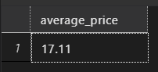
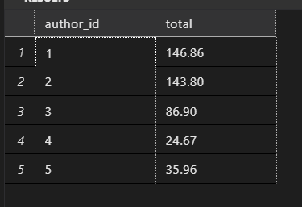
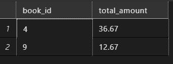
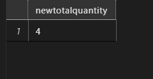
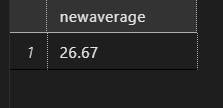

## Section 3

### Task 1

> Stored Procedures with Transactions and Validations

> Add New Book and Update Author's Average Price

> Create a stored procedure that adds a new book and updates the average price of books for the author. Ensure the price is positive, use transactions to ensure data integrity, and return the new average price.

```sql
go
create PROCEDURE AddNewBookUpdateAuthorAveragePrice1
@book_id INT,
@title VARCHAR(50),
@authorid INT,
@genre VARCHAR(50),
@price DECIMAL(10, 2)
AS
BEGIN
BEGIN TRY
IF @price <= 0
BEGIN
THROW 60000, 'Price must be positive', 1;
END

        BEGIN TRANSACTION;

        INSERT INTO books
        (book_id, title, author_id, genre, price)
    VALUES
        (@book_id, @title, @authorid, @genre, @price);

        -- Calculate new average price

        SELECT AVG(price)
    FROM books
    where author_id = @authorid


        COMMIT TRANSACTION;

        SELECT @average_price AS average_price; -- Return the new average price
    END
    TRY
    BEGIN CATCH
    ROLLBACK TRANSACTION;
    PRINT CONCAT('Error number is: ', ERROR_NUMBER());
    PRINT CONCAT('Error message is: ', ERROR_MESSAGE());
    PRINT CONCAT('Error state is: ', ERROR_STATE());
    END CATCH

END

EXEC AddNewBookUpdateAuthorAveragePrice1
@book_id = 11,
@title = 'Hometown ch cha',
@authorid = 6,
@genre = 'Fiction',
@price = 12.67;
```



### Task 2

> Delete Book and Update Author's Total Sales

> Create a stored procedure that deletes a book and updates the author's total sales.

> Ensure the book exists, use transactions to ensure data integrity, and return the new total sales for the author.

```sql
go
CREATE PROC deletesABookUpdatesAuthorsTotal
@bookid int
AS
Begin
  begin TRY
    begin TRANSACTION
      if not exists(select @bookid
                    from books)
            BEGIN
                throw 60000, 'book is not found to delete', 1
            END
     delete from books
     where book_id = @bookid
    commit TRANSACTION
    select sum(total_amount) as total
    from sales s
    join books b
    on b.book_id = s.book_id
    join authors a
    on a.author_id = b.author_id
    group by a.author_id
   end TRY
   BEGIN CATCH
     ROLLBACK TRANSACTION;
      PRINT CONCAT('Error number is: ', ERROR_NUMBER());
      PRINT CONCAT('Error message is: ', ERROR_MESSAGE());
      PRINT CONCAT('Error state is: ', ERROR_STATE());
    END CATCH

end
go

exec deletesABookUpdatesAuthorsTotal @bookid = 10
```



### Task 3

> Transfer Book Sales to Another Book

> Create a stored procedure that transfers sales from one book to another and updates the total sales for both books.

> Ensure both books exist, use transactions to ensure data integrity, and return the new total sales for both books.

```sql

go
alter proc TransferBookSalestoAnotherBook
    @bookid1 INT,
    @bookid2 int
AS
BEGIN

    declare @book1TotalSales decimal(10,2)
    declare @book2TotalSales decimal(10,2)
    BEGIN TRY
    begin transaction
    if not exists (select @bookid1, @bookid2
    from sales)
    BEGIN
    throw 2000, 'book not found', 1
    END

    select @book1TotalSales = total_amount
    from sales
    where book_id = @bookid1

    select @book2TotalSales = total_amount
    from sales
    where book_id = @bookid2

    update sales
    set Total_amount = total_amount+ @book1TotalSales
    where book_id = @bookid2

    update sales
    set Total_amount = total_amount
    where book_id = @bookid1

   commit TRANSACTION
   select book_id, total_amount
    from sales
    where book_id in (@bookid1, @bookid2)
  end
    TRY
  begin CATCH
    ROLLBACK TRANSACTION;
    print concat ('error number is' , Error_number());
    print concat ('error message is' , ERROR_MESSAGE());
    print concat ('error state is' , ERROR_STATE());
    end CATCH
end

exec TransferBookSalestoAnotherBook @bookid1 =9, @bookid2 =4

```



### Task 4

> Add Sale and Update Book Quantity

> Create a stored procedure that adds a sale and updates the total quantity sold for the book. Ensure the quantity is positive, use transactions to ensure data integrity, and return the new total quantity sold for the book.

```sql

go
create proc AddSaleandUpdateBookQuantity
@saleid int ,
@bookid int ,
@saledate date ,
@quantity int,
@totalAmount decimal(10,2)
AS
BEGIN

    DECLARE @newTotalSales int
    BEGIN TRY
      begin TRANSACTION
        if @quantity <=0
          BEGIN
            throw 60000, 'quantity cannot be negative',1
          END
    insert into sales
        (sale_id, book_id, sale_date, quantity, total_amount)
    values
        ( @saleid, @bookid, @saledate, @quantity, @totalAmount)

    update sales
    set quantity = quantity+@quantity
    where book_id = @bookid
    commit TRANSACTION


    select @newTotalSales = quantity
    from sales
    where book_id = @bookid

    select @newTotalSales as newtotalquantity

    END
    TRY
    begin CATCH
    ROLLBACK;
    END Catch

END
-- drop procedure AddSaleandUpdateBookQuantity
exec AddSaleandUpdateBookQuantity
@saleid = 13 ,
@bookid = 2 ,
@saledate = '2024-06-01',
@quantity = 2,
@totalAmount =50.00

```



### Task 4

> Update Book Price and Recalculate Author's Average Price
> Create a stored procedure that updates the price of a book and recalculates the average price of books for the author. Ensure the price is positive, use transactions to ensure data integrity, and return the new average price.

```sql
go
create proc RecalculateAuthorsAveragePrice
@bookid int,
    @bookprice decimal(10,2),
    @authorid int
AS
BEGIN
    BEGIN try
      BEGIN TRANSACTION
         if @bookprice < = 0
           BEGIN
             throw 20000, 'price cannot be negative', 1
           END
         ELSE
          update Books
          set price = @bookprice
          where book_id = @bookid
      commit TRANSACTION
      declare @AuthorAverage decimal(10,2)

      select @AuthorAverage=  avg(price)
    from books
    where author_id = @authorid

      select @AuthorAverage as newaverage
    END
    TRY
    begin CATCH
    ROLLBACK;
    END CATCH
END

exec RecalculateAuthorsAveragePrice  @bookid = 2,
                                     @bookprice = 10.00,
                                     @authorid =2
```


