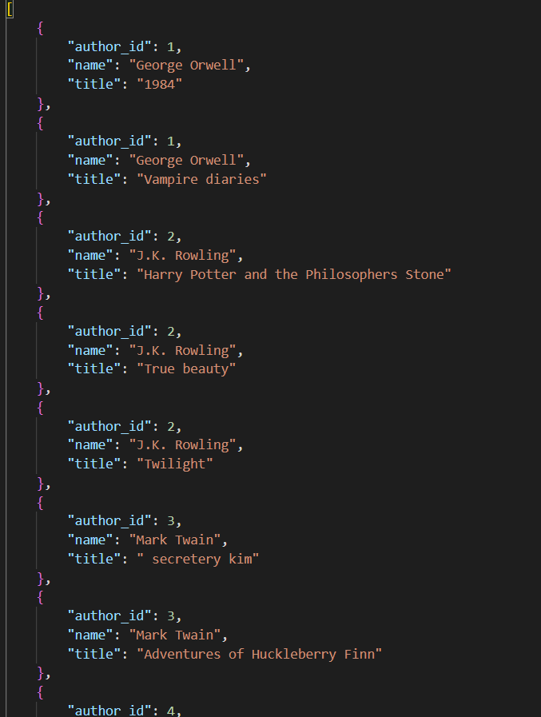

## Section 4 Advanced SQL Concepts

### Task 1

> Inline Table-Valued Function (iTVF)

- Create an inline table-valued function that returns the total sales amount for each book and use it in a query to display the results.

```sql
go
create function totalsalesamountforeachbook
(
    @title varchar(50)
)
returns TABLE
as
return
(
    select b.title, s.total_amount
    from sales s
    join books b
    on b.book_id = s.book_id
where b.title = @title

)
go
select *
from totalsalesamountforeachbook('1984')
```


### Task 2

> Multi-Statement Table-Valued Function (MTVF)

- Create a multi-statement table-valued function that returns the total quantity sold for each genre and use it in a query to display the results.

```sql
go
create function totalquantitysoldforeachgenre (
@genre varchar(50)

)
returns @new TABLE
(genre varchar(50),
    total int)
AS
BEGIN
    insert  @new
    select b.genre, sum(s.quantity)as total
    from sales s
        join books b
        on b.book_id = s.book_id
    where b.genre = @genre
    group by b.genre
    return
end
go
select *
from totalquantitysoldforeachgenre('Fiction')
```


### Task 3

> Scalar Function

- Create a scalar function that returns the average price of books for a given author and use it in a query to display the average price for 'Jane Austen'.

```sql
go
create  function dbo.averagepriceofbooks(
    @authname varchar(50)
)
returns  decimal(10,2)
AS
begin
    declare @new11 decimal(10,2)
    select @new11= avg(b.price)
    from books b
        join authors a
        on a.author_id = b.author_id
    where a.name = @authname;
    return @new11
end
go
SELECT dbo.averagepriceofbooks('Jane Austen') AS AveragePrice;
```


### Task 4

> Stored Procedure for Books with Minimum Sales

- Create a stored procedure that returns books with total sales above a specified amount and use it to display books with total sales above $40.

```sql
go
create proc BookswithMinimumSales

    @amount DECIMAL(10, 2)
AS
BEGIN
    select total_amount
    from sales s
        join books b
        on b.book_id = s.book_id
    where  total_amount > @amount
END
exec BookswithMinimumSales @amount =40.00
```


### Task 5

> Indexing for Performance Improvement

- Create an index on the sales table to improve query performance for queries filtering by book_id.

```sql
create NONCLUSTERED INDEX ix_newBookID
on sales (book_id);
```


### Task 6

> Export Data as XML

- Write a query to export the authors and their books as XML.

```sql
select a.author_id  , a.name, (select b.title as book1
    from books b
    where b.author_id = a.author_id
    for xml path('new'),type) as bookksss
from authors a
    join books b
    on b.author_id = a.author_id

for xml path('Content'), root('Authors')
```


### Task 7

> Export Data as JSON

- Write a query to export the authors and their books as JSON.
  ```sql
  select a.author_id , a.name, b.title
   from authors a
       join books b
       on b.author_id = a.author_id
   group by a.name,a.author_id ,b.title
   for json path
  ```
  

### Task 8

> Scalar Function for Total Sales in a Year

- Create a scalar function that returns the total sales amount in a given year and use it in a query to display the total sales for 2024.

```sql
go
create function dbo.SalesinaYear(
    @year int
)
returns decimal(10,2)
as
BEGIN
    declare @new2 decimal(10,2)
    select @new2 = sum(total_amount)
    from sales
    where year (sale_date) = @year
     group by year (sale_date)
    return @new2
END
go
select dbo.SalesinaYear(2024)
```


### Task9

> Stored Procedure for Genre Sales Report

- Create a stored procedure that returns a sales report for a specific genre, including total sales and average sales, and use it to display the report for 'Fiction'.

```sql
GO
            create proc GenreSalesReport
                @genre varchar(50)
            AS
            BEGIN
                select b.genre,
                    sum(s.total_amount) as totalsales,
                    avg(s.total_amount) as average
                from sales s
                    join books b
                    on b.book_id = s.book_id
                where genre = @genre
                group by genre
            END
            exec GenreSalesReport @genre ='Fiction'
```


### Task 10

> Ranking Books by Average Rating (assuming a ratings table)

- Write a query to rank books by their average rating and display the top 3 books. Assume a ratings table with book_id and rating columns.

```sql
select *
    from Ratings
go
            with
                cte9
                as

                (
                    select b.title, rank() over ( order by avg(rating)  desc ) as rank
                    from Ratings r
                        join books b
                        on b.book_id = r.book_id
                    group by b.book_id, b.title
                )
            select *
            from cte9
            where rank<4
go

```


