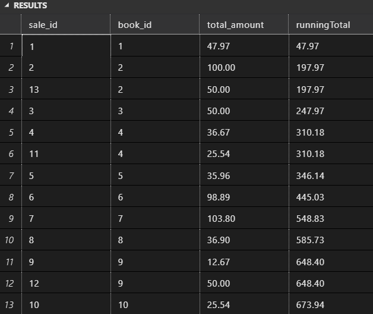
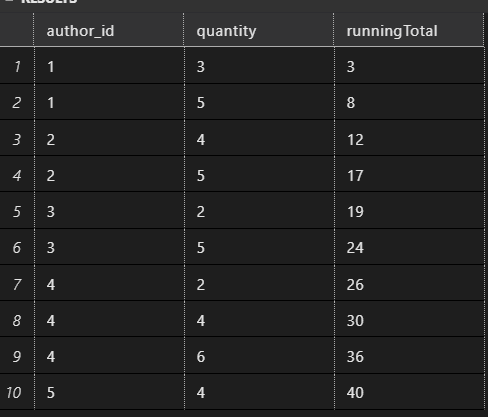
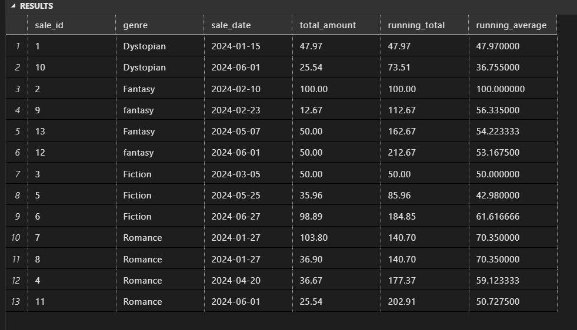
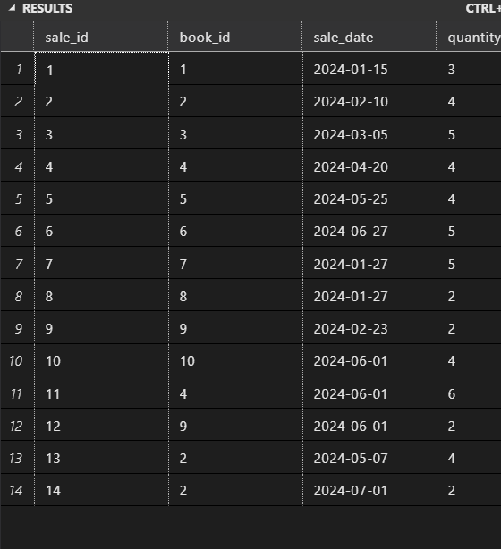
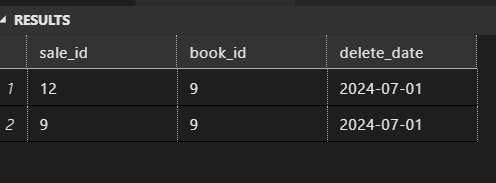
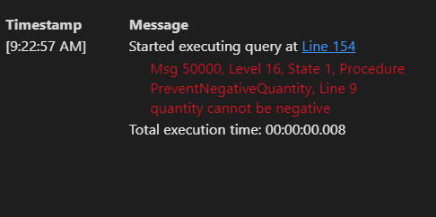

## Section 5

### Questions for Running Total and Running Average with OVER Clause

> Running Total of Sales Amount by Book

- Create a view that displays each sale for a book along with the running total of the sales amount using the OVER clause.

```sql
go
create view eachsaleforabook
as
    select sale_id,
        book_id,
        total_amount,
        sum(total_amount) over (order by book_id) as runningTotal
    from sales
go
select *
from eachsaleforabook
```


-- Running Total
-- go
-- SELECT region,
-- product_type,
-- sales_amount as TotalSales,
-- SUM(sales_amount) over(order by sales_amount ROWS BETWEEN UNBOUNDED PRECEDING AND CURRENT ROW) as CurrentTotal,
-- AVG(sales_amount) over(order by sales_amount ROWS BETWEEN UNBOUNDED PRECEDING AND CURRENT ROW) as AVG_Sales
-- FROM sales_data

> Running Total of Sales Quantity by Author

- Create a view that displays each sale for an author along with the running total of the sales quantity using the OVER clause.

```sql
go
create view eachsaleforanauthor
AS
    select a.author_id,
        s.quantity,
        sum(s.quantity) over(order by a.author_id ROWS BETWEEN UNBOUNDED PRECEDING AND CURRENT ROW) as runningTotal
    from sales s
        join books b
        on b.book_id = s.book_id
        join authors a
        on a.author_id = b.author_id
    group by a.author_id, s.quantity

GO

select * from eachsaleforanauthor
```



> Running Total and Running Average of Sales Amount by Genre

- Create a view that displays each sale for a genre along with both the running total and the running average of the sales amount using the OVER clause.

```sql
CREATE VIEW GenreSalesWithRunningTotalAndAverage
AS
    SELECT
        s.sale_id,
        b.genre,
        s.sale_date,
        s.total_amount,
        SUM(total_amount) OVER (PARTITION BY b.genre ORDER BY sale_date) AS running_total,
        AVG(total_amount) OVER (PARTITION BY b.genre ORDER BY sale_date) AS running_average
    FROM
        sales s
        join books b
        on b.book_id = s.book_id
        join authors a
        on a.author_id = b.author_id;
go
select *
from GenreSalesWithRunningTotalAndAverage
```



## Section 6: Triggers

> Trigger to Update Total Sales After Insert on Sales Table

- Create a trigger that updates the total sales for a book in the books table after a new record is inserted into the sales table.

```sql
go
ALTER TABLE books
ADD total_sales DECIMAL(10, 2) DEFAULT 0;

go
create trigger TX_updateTotal
on Sales
after insert
AS
Begin
    declare @totalSales decimal (10,2),
            @bookid int
    select @totalSales = sum(total_amount),
        @bookid = book_id
    from inserted
    group by book_id

    update books
    set total_sales = isnull(total_sales,0) + @totalSales
    where book_id = @bookid

end

insert into sales
values(12, 2, getdate(), 2, 65)
```



> Trigger to Log Deletions from the Sales Table

- Create a trigger that logs deletions from the sales table into a sales_log table with the sale_id, book_id, and the delete_date.

```sql
create table sales_log
(
    sale_id int,
    book_id int,
    delete_date date

)
go

alter trigger TX_booktable
on sales
after delete
as
BEGIN
    insert into sales_log
        (sale_id, book_id, delete_date)
    select sale_id, book_id, getdate()
    from deleted
end
  delete from sales
  where book_id = 10

select *
from sales_log

```



> Trigger to Prevent Negative Quantity on Update

- Create a trigger that prevents updates to the sales table if the new quantity is negative.

```sql
GO
alter trigger PreventNegativeQuantity
on sales
INSTEAD OF UPDATE
AS
BEGIN
    if exists(select *
    from inserted
    where quantity<0)
   throw 9000, 'quantity cannot be negative', 1
ELSE
   UPDATE sales
        SET quantity = i.quantity
        FROM sales s
        INNER JOIN inserted i ON s.sale_id = i.sale_id;

end
-- drop trigger PreventNegativeQuantity

insert into sales
values(13, 4, GETDATE(), -2, 24.00)
select *
from sales
delete from sales where sale_id = 13

```


